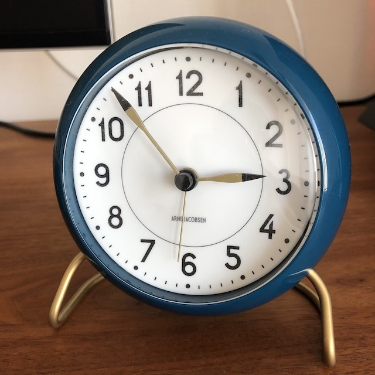

# GoogleNet

## Input



Ailia input shape: (224, 224, 3)  
Range : [0.0, 255.0] 

## Output

```
+ idx=0
  category=409[analog clock ]
  prob=11.58469009399414
  value=141
+ idx=1
  category=892[wall clock ]
  prob=10.812376976013184
  value=135
+ idx=2
  category=426[barometer ]
  prob=8.752877235412598
  value=119
```

## Usage
Automatically downloads the tflite files on the first run. It is necessary to be connected to the Internet while downloading.

For the sample image,
```
$ python3 googlenet.py
```

If you want to specify the input image, put the image path after the `--input` option.
```
$ python3 googlenet.py --input IMAGE_PATH
```
By adding the `--video` option, you can input the video.
If you pass `0` as an argument to VIDEO_PATH, you can use the webcam input instead of the video file.
```
$ python3 googlenet.py --video VIDEO_PATH
```


## Reference

[Going Deeper with Convolutions]( https://arxiv.org/abs/1409.4842 )

[GOOGLENET]( https://pytorch.org/hub/pytorch_vision_googlenet/)


## Framework

TensorFlow 2.12.0

## Netron

[googlenet_float32.tflite](https://netron.app/?url=https://storage.googleapis.com/ailia-models-tflite/googlenet/googlenet_float32.tflite)

[googlenet_quant_recalib.tflite](https://netron.app/?url=https://storage.googleapis.com/ailia-models-tflite/googlenet/googlenet_quant_recalib.tflite)
