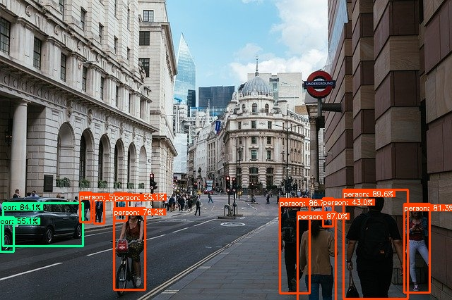

# YOLOX

## Input


(Image from https://github.com/RangiLyu/nanodet/blob/main/demo_mnn/imgs/000252.jpg)

- ailia input shape: (1, 3, 416, 416) or (1, 3, 640, 640)

## Output



- category : [0, 79]
- probablity : [0.0, 1.0]
- position : x, y, w, h (in pixels scaled to the image size)

## Usage

Automatically downloads the tflite file on the first run.
It is necessary to be connected to the Internet while downloading.

For the sample image,

``` bash
$ python3 yolox.py
```

If you want to specify the input image, put the image path after the `--input` option.  
You can use `--savepath` option to change the name of the output file to save.

```bash
$ python3 yolox.py --input IMAGE_PATH --savepath SAVE_IMAGE_PATH
```

By adding the `--video` option, you can input the video.   
If you pass `0` as an argument to VIDEO_PATH, you can use the webcam input instead of the video file.

```bash
$ python3 yolox.py --video VIDEO_PATH
```

## Reference

- [YOLOX](https://github.com/Megvii-BaseDetection/YOLOX)

## Framework

Pytorch

## Model Format

Tensorflow 2.7.0

## Netron

- [yolox_tiny_full_integer_quant.tflite](https://netron.app/?url=https://storage.googleapis.com/ailia-models-tflite/yolox/yolox_tiny_full_integer_quant.tflite)
- [yolox_tiny_full_integer_quant.opt.tflite](https://netron.app/?url=https://storage.googleapis.com/ailia-models-tflite/yolox/yolox_tiny_full_integer_quant.opt.tflite)